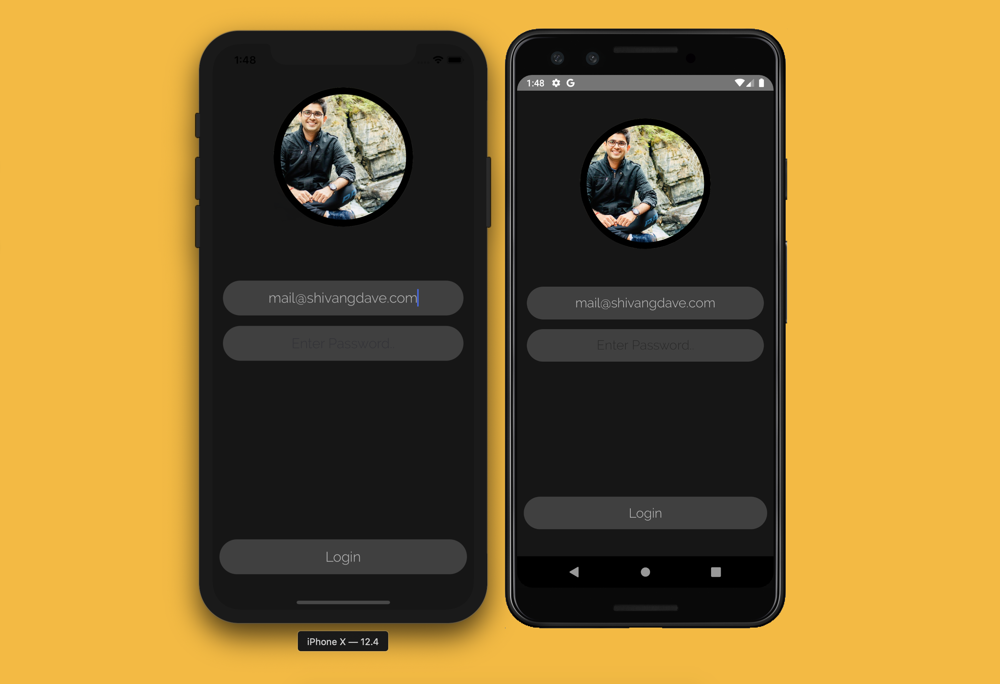
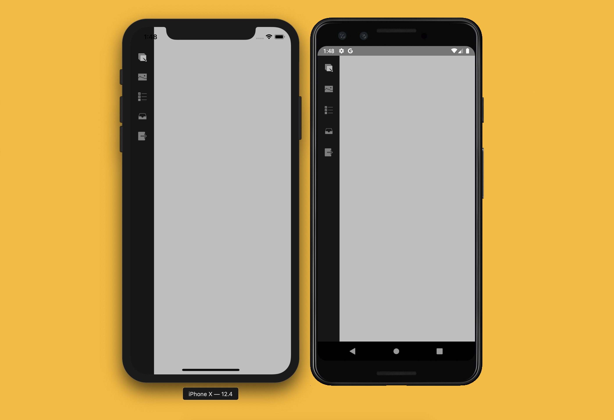
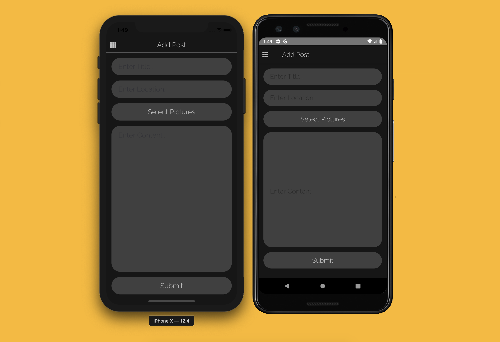
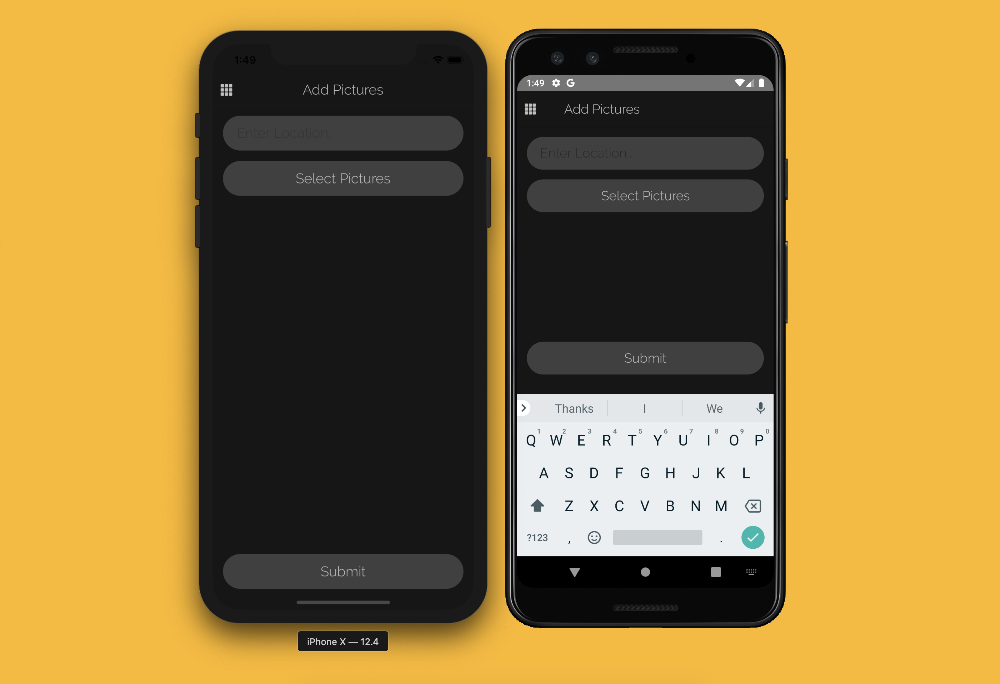
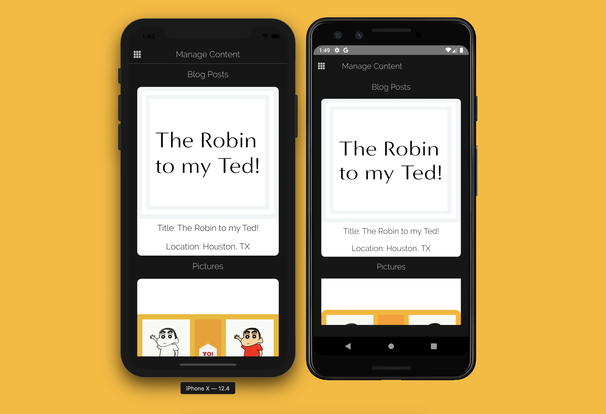
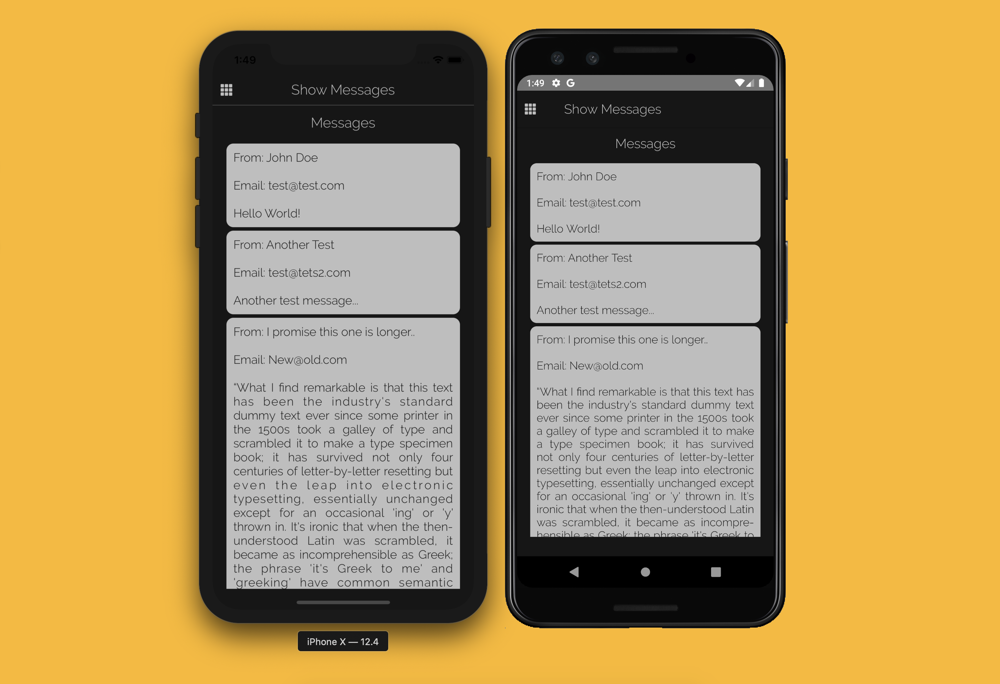

# Blog Mobile App

- [x] Language: React Native
- [x] Platform: iOS, Android
- [x] Backend: Rails RESTFul API
- [x] Additional:
  - [x] JWT Auth
  - [x] Backend Hosting - DigitalOcean Droplet

### Screenshots:

